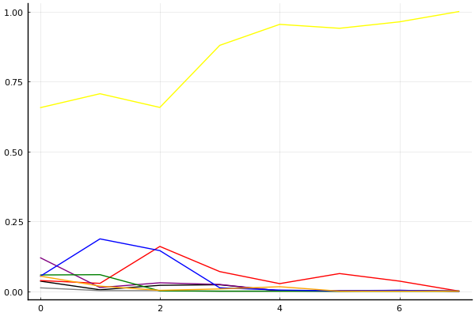
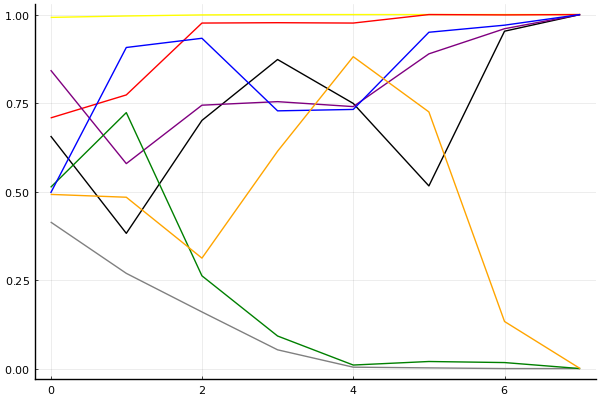

2021 시즌 1 개인전 32강 A조

<iframe width="560" height="315" src="https://www.youtube.com/embed/CEUQh8Ou1wo" frameborder="0" allow="accelerometer ;clipboard-write; encrypted-media; gyroscope; picture-in-picture" allowfullscreen></iframe>

## 경기 결과

| 트랙 | 이재혁 | 신종민 | 김정제 | 정유민 | 유영혁 | 홍승민 | 유민선 | 이명재 |
|:---|---:|---:|---:|---:|---:|---:|---:|---:|
| [올림포스 하늘의 신전](../shinjeon) | 10 | 0 | 7 | 1 | -1 | 4 | 5 | 3 |
| [[리버스] 포레스트 지그재그](../rzigzag) | 3 | 7 | 10 | -1 | 5 | 0 | 4 | 1 |
| [포레스트 통곡의 절벽](../tonggok) | 10 | 7 | 3 | -1 | 4 | 0 | 1 | 5 |
| [월드 이탈리아 피사의 사탑](../pizza) | 10 | 1 | 3 | -1 | 5 | 0 | 4 | 7 |
| [공동묘지 해골 손가락](../haeson) | 7 | -1 | 10 | 1 | 4 | 3 | 5 | 0 |
| [노르테유 익스프레스](../noex) | 3 | 10 | 1 | -1 | 7 | 4 | 5 | 0 |
| [카멜롯 외곽 순찰로](../sunchalro) | 7 | 10 | 4 | 1 | 0 | -1 | 5 | 3 |
| __total__ |__50__ |__34__ |__38__ |__-1__ |__24__ |__10__ |__29__ |__19__ |

## 시뮬레이션

### 1st 확률

x축: 트랙, y축: 확률
1번: 옐로우, 2번: 블랙, 3번: 레드, 4번: 화이트(회색), 5번: 퍼플, 6번: 그린, 7번: 블루, 8번: 오렌지

| 트랙 | 이재혁 | 신종민 | 김정제 | 정유민 | 유영혁 | 홍승민 | 유민선 | 이명재 |
|:---|---:|---:|---:|---:|---:|---:|---:|---:|
| 초기 | 0.656 | 0.036 | 0.038 | 0.012 | 0.120 | 0.058 | 0.053 | 0.054 |
| 올림포스 하늘의 신전 | 0.706 | 0.005 | 0.028 | 0.002 | 0.013 | 0.059 | 0.187 | 0.018 |
| [리버스] 포레스트 지그재그 | 0.657 | 0.021 | 0.160 | 0.002 | 0.030 | 0.001 | 0.145 | 0.003 |
| 포레스트 통곡의 절벽 | 0.879 | 0.023 | 0.070 | 0.000 | 0.024 | 0.000 | 0.012 | 0.008 |
| 월드 이탈리아 피사의 사탑 | 0.954 | 0.001 | 0.027 | 0.000 | 0.001 | 0.000 | 0.004 | 0.016 |
| 공동묘지 해골 손가락 | 0.940 | 0.000 | 0.063 | 0.000 | 0.002 | 0.000 | 0.001 | 0.000 |
| 노르테유 익스프레스 | 0.963 | 0.002 | 0.036 | 0.000 | 0.003 | 0.000 | 0.003 | 0.000 |
| 카멜롯 외곽 순찰로 | 1.000 | 0.000 | 0.000 | 0.000 | 0.000 | 0.000 | 0.000 | 0.000 |

### Advance 확률

x축: 트랙, y축: 확률
1번: 옐로우, 2번: 블랙, 3번: 레드, 4번: 화이트(회색), 5번: 퍼플, 6번: 그린, 7번: 블루, 8번: 오렌지

| 트랙 | 이재혁 | 신종민 | 김정제 | 정유민 | 유영혁 | 홍승민 | 유민선 | 이명재 |
|:---|---:|---:|---:|---:|---:|---:|---:|---:|
| 초기 | 0.950 | 0.323 | 0.329 | 0.132 | 0.578 | 0.271 | 0.269 | 0.250 |
| 올림포스 하늘의 신전 | 0.973 | 0.107 | 0.393 | 0.066 | 0.236 | 0.416 | 0.702 | 0.198 |
| [리버스] 포레스트 지그재그 | 0.952 | 0.236 | 0.768 | 0.019 | 0.289 | 0.044 | 0.700 | 0.072 |
| 포레스트 통곡의 절벽 | 0.993 | 0.447 | 0.798 | 0.004 | 0.297 | 0.013 | 0.310 | 0.208 |
| 월드 이탈리아 피사의 사탑 | 1.000 | 0.262 | 0.791 | 0.000 | 0.262 | 0.002 | 0.254 | 0.530 |
| 공동묘지 해골 손가락 | 1.000 | 0.072 | 0.997 | 0.000 | 0.345 | 0.002 | 0.490 | 0.192 |
| 노르테유 익스프레스 | 0.999 | 0.294 | 0.963 | 0.000 | 0.350 | 0.000 | 0.426 | 0.012 |
| 카멜롯 외곽 순찰로 | 1.000 | 1.000 | 1.000 | 0.000 | 0.000 | 0.000 | 0.000 | 0.000 |

### 생존 확률

x축: 트랙, y축: 확률
1번: 옐로우, 2번: 블랙, 3번: 레드, 4번: 화이트(회색), 5번: 퍼플, 6번: 그린, 7번: 블루, 8번: 오렌지

| 트랙 | 이재혁 | 신종민 | 김정제 | 정유민 | 유영혁 | 홍승민 | 유민선 | 이명재 |
|:---|---:|---:|---:|---:|---:|---:|---:|---:|
| 초기 | 0.992 | 0.657 | 0.708 | 0.414 | 0.843 | 0.512 | 0.496 | 0.492 |
| 올림포스 하늘의 신전 | 0.996 | 0.382 | 0.773 | 0.269 | 0.579 | 0.723 | 0.907 | 0.484 |
| [리버스] 포레스트 지그재그 | 0.999 | 0.701 | 0.976 | 0.160 | 0.744 | 0.262 | 0.933 | 0.312 |
| 포레스트 통곡의 절벽 | 1.000 | 0.873 | 0.977 | 0.053 | 0.754 | 0.092 | 0.728 | 0.614 |
| 월드 이탈리아 피사의 사탑 | 1.000 | 0.749 | 0.976 | 0.004 | 0.740 | 0.010 | 0.732 | 0.881 |
| 공동묘지 해골 손가락 | 1.000 | 0.516 | 1.000 | 0.002 | 0.889 | 0.020 | 0.950 | 0.725 |
| 노르테유 익스프레스 | 1.000 | 0.953 | 0.999 | 0.000 | 0.960 | 0.017 | 0.970 | 0.133 |
| 카멜롯 외곽 순찰로 | 1.000 | 1.000 | 1.000 | 0.000 | 1.000 | 0.000 | 1.000 | 0.000 |

## 랭킹 변동

### [전체 랭킹](../singles-full)

| 순위 | 변동 | 이름 | 점수 | 변동 | mu | 변동 | sigma | 변동 |
|---:|---:|:---:|---:|---:|---:|---:|---:|---:|
| 2 / 96 | +0 | [이재혁](../ijaehyeok) | 3389 | +24 | 3624 | +24 | 78 | -0 |
| 8 / 96 | -2 | [유영혁](../yuyeonghyeok) | 3103 | -14 | 3331 | -14 | 76 | -0 |
| 12 / 96 | +2 | [김정제](../gimjeongje) | 3045 | +39 | 3276 | +38 | 77 | -0 |
| 15 / 96 | +2 | [신종민](../shinjongmin) | 3018 | +26 | 3249 | +27 | 77 | +0 |
| 35 / 96 | NaN | [유민선](../yuminseon) | 2763 | +2763 | 3397 | +397 | 211 | -789 |
| 39 / 96 | -6 | [정유민](../jeongyumin) | 2673 | -102 | 2984 | -127 | 104 | -8 |
| 49 / 96 | NaN | [이명재](../imyeongjae) | 2504 | +2504 | 3145 | +145 | 214 | -786 |
| 68 / 96 | NaN | [홍승민](../hongseungmin) | 2235 | +2235 | 2891 | -109 | 219 | -781 |

### 시즌 랭킹

| 순위 | 변동 | 이름 | 점수 | 변동 | mu | 변동 | sigma | 변동 |
|---:|---:|:---:|---:|---:|---:|---:|---:|---:|
| 1 / 8 | NaN | [이재혁](../ijaehyeok) | 2891 | +2891 | 3645 | +645 | 251 | -749 |
| 2 / 8 | NaN | [김정제](../gimjeongje) | 2592 | +2592 | 3322 | +322 | 243 | -757 |
| 3 / 8 | NaN | [유민선](../yuminseon) | 2553 | +2553 | 3239 | +239 | 229 | -771 |
| 4 / 8 | NaN | [신종민](../shinjongmin) | 2530 | +2530 | 3264 | +264 | 245 | -755 |
| 5 / 8 | NaN | [유영혁](../yuyeonghyeok) | 2347 | +2347 | 3048 | +48 | 234 | -766 |
| 6 / 8 | NaN | [이명재](../imyeongjae) | 2181 | +2181 | 2880 | -120 | 233 | -767 |
| 7 / 8 | NaN | [홍승민](../hongseungmin) | 1821 | +1821 | 2546 | -454 | 242 | -758 |
| 8 / 8 | NaN | [정유민](../jeongyumin) | 1314 | +1314 | 2135 | -865 | 274 | -726 |

### 트랙 별 랭킹

#### [[리버스] 포레스트 지그재그](../rzigzag)

| 순위 | 변동 | 이름 | 점수 | 변동 | mu | 변동 | sigma | 변동 |
|:---:|:---:|:---:|---:|---:|---:|---:|---:|---:|
| 1 / 8 | NaN | [김정제](../gimjeongje) | 2161 | +2161 | 4274 | +1274 | 704 | -296 |
| 2 / 8 | NaN | [신종민](../shinjongmin) | 1887 | +1887 | 3763 | +763 | 625 | -375 |
| 3 / 8 | NaN | [유영혁](../yuyeonghyeok) | 1622 | +1622 | 3423 | +423 | 600 | -400 |
| 4 / 8 | NaN | [유민선](../yuminseon) | 1363 | +1363 | 3137 | +137 | 591 | -409 |
| 5 / 8 | NaN | [이재혁](../ijaehyeok) | 1090 | +1090 | 2863 | -137 | 591 | -409 |
| 6 / 8 | NaN | [이명재](../imyeongjae) | 776 | +776 | 2577 | -423 | 600 | -400 |
| 7 / 8 | NaN | [홍승민](../hongseungmin) | 361 | +361 | 2237 | -763 | 625 | -375 |
| 8 / 8 | NaN | [정유민](../jeongyumin) | -388 | -388 | 1726 | -1274 | 704 | -296 |

#### [공동묘지 해골 손가락](../haeson)

| 순위 | 변동 | 이름 | 점수 | 변동 | mu | 변동 | sigma | 변동 |
|:---:|:---:|:---:|---:|---:|---:|---:|---:|---:|
| 2 / 50 | +0 | [이재혁](../ijaehyeok) | 3119 | +45 | 3680 | +19 | 187 | -9 |
| 3 / 50 | +0 | [유영혁](../yuyeonghyeok) | 3051 | -16 | 3649 | -49 | 199 | -11 |
| 13 / 50 | +6 | [김정제](../gimjeongje) | 2404 | +352 | 3189 | +282 | 262 | -23 |
| 21 / 50 | -8 | [신종민](../shinjongmin) | 1940 | -353 | 3027 | -513 | 362 | -53 |
| 22 / 50 | NaN | [유민선](../yuminseon) | 1931 | +1931 | 3463 | +463 | 511 | -489 |
| 33 / 50 | NaN | [홍승민](../hongseungmin) | 1523 | +1523 | 3091 | +91 | 523 | -477 |
| 39 / 50 | NaN | [정유민](../jeongyumin) | 1283 | +1283 | 2883 | -117 | 534 | -466 |
| 41 / 50 | NaN | [이명재](../imyeongjae) | 1034 | +1034 | 2667 | -333 | 544 | -456 |

#### [노르테유 익스프레스](../noex)

| 순위 | 변동 | 이름 | 점수 | 변동 | mu | 변동 | sigma | 변동 |
|:---:|:---:|:---:|---:|---:|---:|---:|---:|---:|
| 3 / 72 | +0 | [이재혁](../ijaehyeok) | 3510 | -66 | 4090 | -96 | 193 | -10 |
| 4 / 72 | +0 | [유영혁](../yuyeonghyeok) | 3317 | +55 | 3841 | +34 | 175 | -7 |
| 7 / 72 | +0 | [김정제](../gimjeongje) | 3029 | -52 | 3670 | -90 | 214 | -13 |
| 12 / 72 | +4 | [신종민](../shinjongmin) | 2843 | +307 | 3623 | +241 | 260 | -22 |
| 23 / 72 | NaN | [유민선](../yuminseon) | 2174 | +2174 | 3701 | +701 | 509 | -491 |
| 24 / 72 | NaN | [홍승민](../hongseungmin) | 2025 | +2025 | 3548 | +548 | 508 | -492 |
| 54 / 72 | NaN | [이명재](../imyeongjae) | 868 | +868 | 2707 | -293 | 613 | -387 |
| 67 / 72 | NaN | [정유민](../jeongyumin) | -116 | -116 | 2072 | -928 | 729 | -271 |

#### [올림포스 하늘의 신전](../shinjeon)

| 순위 | 변동 | 이름 | 점수 | 변동 | mu | 변동 | sigma | 변동 |
|:---:|:---:|:---:|---:|---:|---:|---:|---:|---:|
| 1 / 8 | NaN | [이재혁](../ijaehyeok) | 2161 | +2161 | 4274 | +1274 | 704 | -296 |
| 2 / 8 | NaN | [김정제](../gimjeongje) | 1887 | +1887 | 3763 | +763 | 625 | -375 |
| 3 / 8 | NaN | [유민선](../yuminseon) | 1622 | +1622 | 3423 | +423 | 600 | -400 |
| 4 / 8 | NaN | [홍승민](../hongseungmin) | 1363 | +1363 | 3137 | +137 | 591 | -409 |
| 5 / 8 | NaN | [이명재](../imyeongjae) | 1090 | +1090 | 2863 | -137 | 591 | -409 |
| 6 / 8 | NaN | [정유민](../jeongyumin) | 776 | +776 | 2577 | -423 | 600 | -400 |
| 7 / 8 | NaN | [신종민](../shinjongmin) | 361 | +361 | 2237 | -763 | 625 | -375 |
| 8 / 8 | NaN | [유영혁](../yuyeonghyeok) | -388 | -388 | 1726 | -1274 | 704 | -296 |

#### [월드 이탈리아 피사의 사탑](../pizza)

| 순위 | 변동 | 이름 | 점수 | 변동 | mu | 변동 | sigma | 변동 |
|:---:|:---:|:---:|---:|---:|---:|---:|---:|---:|
| 1 / 37 | +0 | [이재혁](../ijaehyeok) | 3282 | +145 | 4073 | +105 | 264 | -13 |
| 8 / 37 | +2 | [유영혁](../yuyeonghyeok) | 2549 | +119 | 3303 | +61 | 252 | -19 |
| 14 / 37 | -1 | [신종민](../shinjongmin) | 2157 | -36 | 2955 | -101 | 266 | -22 |
| 15 / 37 | NaN | [이명재](../imyeongjae) | 2052 | +2052 | 3718 | +718 | 555 | -445 |
| 23 / 37 | NaN | [유민선](../yuminseon) | 1570 | +1570 | 3174 | +174 | 535 | -465 |
| 24 / 37 | NaN | [김정제](../gimjeongje) | 1339 | +1339 | 2949 | -51 | 537 | -463 |
| 29 / 37 | NaN | [홍승민](../hongseungmin) | 584 | +584 | 2358 | -642 | 591 | -409 |
| 33 / 37 | NaN | [정유민](../jeongyumin) | -259 | -259 | 1822 | -1178 | 694 | -306 |

#### [카멜롯 외곽 순찰로](../sunchalro)

| 순위 | 변동 | 이름 | 점수 | 변동 | mu | 변동 | sigma | 변동 |
|:---:|:---:|:---:|---:|---:|---:|---:|---:|---:|
| 1 / 8 | NaN | [신종민](../shinjongmin) | 2161 | +2161 | 4274 | +1274 | 704 | -296 |
| 2 / 8 | NaN | [이재혁](../ijaehyeok) | 1887 | +1887 | 3763 | +763 | 625 | -375 |
| 3 / 8 | NaN | [유민선](../yuminseon) | 1622 | +1622 | 3423 | +423 | 600 | -400 |
| 4 / 8 | NaN | [김정제](../gimjeongje) | 1363 | +1363 | 3137 | +137 | 591 | -409 |
| 5 / 8 | NaN | [이명재](../imyeongjae) | 1090 | +1090 | 2863 | -137 | 591 | -409 |
| 6 / 8 | NaN | [정유민](../jeongyumin) | 776 | +776 | 2577 | -423 | 600 | -400 |
| 7 / 8 | NaN | [유영혁](../yuyeonghyeok) | 361 | +361 | 2237 | -763 | 625 | -375 |
| 8 / 8 | NaN | [홍승민](../hongseungmin) | -388 | -388 | 1726 | -1274 | 704 | -296 |

#### [포레스트 통곡의 절벽](../tonggok)

| 순위 | 변동 | 이름 | 점수 | 변동 | mu | 변동 | sigma | 변동 |
|:---:|:---:|:---:|---:|---:|---:|---:|---:|---:|
| 1 / 8 | NaN | [이재혁](../ijaehyeok) | 2161 | +2161 | 4274 | +1274 | 704 | -296 |
| 2 / 8 | NaN | [신종민](../shinjongmin) | 1887 | +1887 | 3763 | +763 | 625 | -375 |
| 3 / 8 | NaN | [이명재](../imyeongjae) | 1622 | +1622 | 3423 | +423 | 600 | -400 |
| 4 / 8 | NaN | [유영혁](../yuyeonghyeok) | 1363 | +1363 | 3137 | +137 | 591 | -409 |
| 5 / 8 | NaN | [김정제](../gimjeongje) | 1090 | +1090 | 2863 | -137 | 591 | -409 |
| 6 / 8 | NaN | [유민선](../yuminseon) | 776 | +776 | 2577 | -423 | 600 | -400 |
| 7 / 8 | NaN | [홍승민](../hongseungmin) | 361 | +361 | 2237 | -763 | 625 | -375 |
| 8 / 8 | NaN | [정유민](../jeongyumin) | -388 | -388 | 1726 | -1274 | 704 | -296 |
