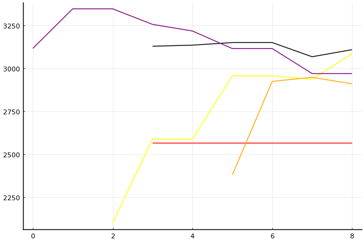
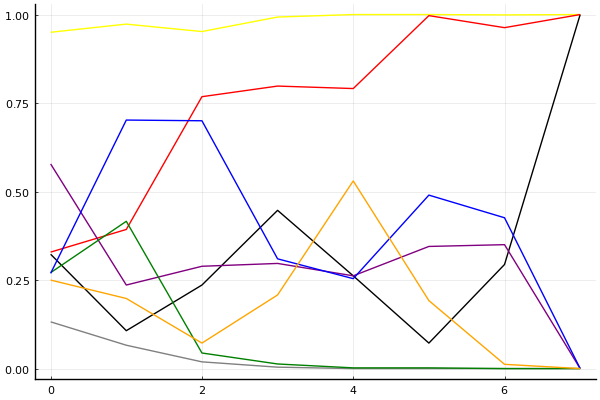

[팀전 포스트시즌 방식의 발상지](../season-design-2)! 카트리그 전적/랭킹 블로그 (ver. 1.1). 
__최종 업데이트: 2021-03-10__

## 주요 랭킹
- [팀전 - 최신 팀 파워랭킹](../power-ranking-20210306)
- [팀전 - 전체 트랙](../team-full)
- [팀전 - 스피드](../team-speed)
- [팀전 - 아이템](../team-item)
- [팀전 - 에이스 결정전](../team-ace)
- [개인전 - 종합](../singles-full)

## 참고 자료
- 2020-7-13: [개인전 점수-진출확률 변환표](../conversion)

## 사설 
- 2021-02-20~: [2021 시즌 1 규정 트래커](../rule-tracker)
- 2021-02-19: [타이브레이커 (2)](../tiebreakers-2)
- 2020-12-28: [2021 시즌 1 예선: 그 후](../qualifiers-after-2021-1)
- 2020-12-23: [2021 시즌 1 예선](../qualifiers-2021-1.md)
- 2020-12-20: [2021 시즌 1 오프시즌](../offseason-2021-1)
- 2020-10-12: [사설 - 풀리그 방식에서의 에이스 결정전. 다승제는 과연 올바른가](../ace-in-round-robin)
- 2020-7-4: [사설 - 타이브레이커](../tiebreakers)
- 2020-6-26: [사설 - 밴픽](../ban-pick)
- 2020-5-26: [사설 - 개인전 50점/80점 선취제에 필요한 최대 트랙의 수는?](../track-optim)
- 2020-5-24: [2020 시즌 1 마무리 - 그동안 있었던 일](../season-wrapup-2020-1)
- 2020-5-19: [사설 - 내 맘대로 짜보는 리그 3 - 개인전](../season-design-3)
- 2020-5-17: [사설 - 내 맘대로 짜보는 리그 2 - 팀전](../season-design-2)
- 2020-5-13: [사설 - 내 맘대로 짜보는 리그 1](../season-design-1)
- 2020-3-1: [사설 - 2월 22일자 개인전 TMI 승부 예측](../editorial-tmi-0222)
- 2020-1-25: [사설 - 잡다한 생각들](../thoughts)
- 2020-1-17: [사설 - TMI 승부 예측](../editorial-tmi)

## 시즌
- [2021 시즌 1](../2021-1)
- [2020 시즌 2](../2020-2)
- [2020 시즌 1](../2020-1)

### 올드 시즌
- [2005 1차리그](../oldranking/series-1)

 

## 분석 방법

[TrueSkill](https://trueskill.org/). 이 방법은 Microsoft Research에서 개발한 방법으로 각 선수의 기량을 두 개의 숫자, 평균 mu(추정된 기량의 위치), 표준편차 sigma(추정된 기량의 불확실성)로 나타내고 베이지안 추론을 통해 추정된 mu와 sigma에 기반하여 순위를 매긴다. 
선수들이 경기를 많이 할수록 일반적으로 선수의 기량을 좀 더 정확히 추정할 수 있을테니 mu는 점점 제자리를 찾아가고, sigma는 점점 줄어들게 된다. 
이 블로그의 모든 분석에서 각 선수는 mu=3000, sigma=1000로 시작. 팀전 랭킹의 mu는 네 명의 mu 합산을 기준으로, sigma는 네 명의 sigma 제곱의 합의 제곱근을 기준으로 계산. 종합 랭킹의 경우 스피드전 또는 아이템전만 참가하는 선수는 1/2명으로 계산하여 이에 맞게 계산식을 적절히 변형함.  

분석의 단위:

- 개인전: 각 트랙의 순위.
- 팀전: 각 트랙의 승패. 이에 따라 기존에 문호준 선수보다 더 성적이 좋은 팀에 있었던 최영훈 선수가 더 높은 순위를 가짐.

[조금 더 자세한 설명 보러가기](../about)

### 순위표
선수들의 순위를 나타낼 때는 mu를 그대로 쓰는 대신 실력을 *보수적으로* 추정하는 값인 mu - k sigma 를 사용한다. k가 클수록 각 선수의 실력이 mu - k sigma 보다 클 확률이 매우 높아진다는 의미에서. 주로 쓰이는 k값은 3이고, 정규분포의 특성에 의해 선수의 실력이 그 값보다 높을 확률은 99% 이상이 된다. 여기에서도 k=3을 사용.

예를 들어, 2020년 1월 1일 시점 박도현의 추정된 mu는 이재혁의 그것보다 높지만 박도현이 지금까지 치른 경기 수가 적어 불확실성 sigma 크기 때문에 그만큼 점수를 깎으므로 박도현이 이재혁보다 밑에 있게 된다.

### 데이터
분석에 사용된 데이터는 [여기](https://github.com/KartRanking/KartRanking/tree/master/dat)에 공개되어 있음.

2015년 카트라이더 리그 에볼루션 이후 모든 팀전, 개인전 TV 방송 경기. 8인전, 7인전, 4인전, 2인전 모두 포함 (2017 케스파 컵과 듀얼레이스 X 포함, 티밍이 있었던 글로벌 슈퍼매치 제외)

## [팀전](../team-power-ranking)

### 순위표

| 순위 | 팀 | 경기 수 | 승 | 패 | 세트 득실 | 트랙 득실 | 승점 |
|---:|---:|---:|---:|---:|---:|---:|---:|
| 1 | HLE | 1 | 1 | 0 | +2 | +5 | 3 |
| 2 | SB | 1 | 1 | 0 | +2 | +4 | 3 |
| 3 | FZ | 1 | 1 | 0 | +1 | +1 | 2 |
| 4 | LY | 2 | 1 | 1 | +1 | +3 | 4 |
| 5 | ROX | 0 | 0 | 0 | 0 | 0 | 0 |
| 5 | EST | 0 | 0 | 0 | 0 | 0 | 0 |
| 7 | AF | 1 | 0 | 1 | -2 | -5 | 0 |
| 8 | CLG | 2 | 0 | 2 | -4 | -8 | 0 |

* 순위 산정 기준: 승수-세트 득실-트랙 득실-승자승 순. 
* 경기수가 다른 팀들의 경우 승패차-승률-세트 득실-트랙 득실-승자승 순으로 순위 결정([2020년 9월 5일 방송 도입부](https://youtu.be/1rHcBg_H5Jk?t=155)). [3팀 이상 동률의 처리 규정에 대해서는 알려지지 않음](../tiebreakers).
* 승점: 공식 기록 아님, 2-0 승 3점, 2-1 승 2점, 1-2 패 1점, 0-2 패 0점. 

<!--
### 포스트시즌 업데이트

| 날짜 | 경기 | 레드 | 블루 | 
|:---:|:---:|:---:|:---:|
| 10/17 | WC | EST | __AF__ |
| 10/21 | 준PO | __HLE__ | AF |
| 10/24 | 결승진출전 | SB | __ROX__ |
| 11/7 | PO | SB | __HLE__ |
| 11/8 | 결승전 | ROX | __HLE__ |

- 2020-10-05: [김대겸 해설위원 유튜브](https://youtu.be/Df3vo0ENzYk?t=186)를 통해 포스트시즌에서는 8강 풀리그 상위팀에게 밴픽 어드밴티지 있음이 공개됨. 
- 2020-10-14: 김대겸 해설위원 방송을 통해 포스트시즌 밴픽 방식 공개. 
    - 스피드전 아이템전 모두 동일한 방식. 레드: 상위 진출팀, 블루: 하위 진출팀.
    - 결승전의 경우 밴픽 어드밴티지는 결승 진출전 승자가 받는 것으로 변경됨. 

    1. 트랙 1은 고정.
    2. 레드 픽 (트랙 2)
    3. 블루 밴
    4. 레드 밴
    5. 블루 픽 (트랙 3)
    6. 레드 픽 (트랙 4)
    7. 블루 픽 (트랙 5)
    8. 레드 픽 (트랙 6)
    9. 블루 픽 (트랙 7)
 -->

<!--
#### Video
<iframe
src="https://www.youtube.com/embed/Hfg1tYuBCAk" width="640" height="360" frameborder="0" scrolling="no" allowfullscreen>
</iframe>
<iframe 
src="https://www.youtube.com/embed/6-ivHY4lXzM" width="640" height="360" frameborder="0" scrolling="no" allowfullscreen>
</iframe>
-->

### 리뷰: [8강 풀리그 3-4경기](../t2021-1-1-2)

<!--
#### Video
<iframe
src="https://www.youtube.com/embed/Hfg1tYuBCAk" width="640" height="360" frameborder="0" scrolling="no" allowfullscreen>
</iframe>
<iframe 
src="https://www.youtube.com/embed/6-ivHY4lXzM" width="640" height="360" frameborder="0" scrolling="no" allowfullscreen>
</iframe>
-->

#### 전체 

| 순위 | 팀 | 점수 | 변동 | mu | 변동 | sigma | 변동 |
|---:|---:|---:|---:|---:|---:|---:|---:|
| 1 | HLE | 12425 | +0 | 13311 | +0 | 295 | +0 |
| 2 | SB | 12160 | -31 | 13035 | -26 | 291 | +2 |
| 3 | ROX | 11848 | +0 | 12749 | +0 | 300 | +0 |
| 4 | AF | 11340 | +0 | 12294 | +0 | 318 | +0 |
| 5 | EST | 11293 | +0 | 12318 | +0 | 342 | +0 |
| 6 | LIL | 10071 | +50 | 12404 | -608 | 778 | -219 |
| 7 | FZN | 9600 | +3213 | 13316 | +1316 | 1239 | -632 |
| 8 | CLG | 8247 | +1552 | 11280 | +762 | 1011 | -263 |

#### 스피드전

| 순위 | 팀 | 점수 | 변동 | mu | 변동 | sigma | 변동 |
|---:|---:|---:|---:|---:|---:|---:|---:|
| 1 | SB | 12392 | -8 | 13488 | -12 | 365 | -1 |
| 2 | HLE | 12372 | +0 | 13414 | +0 | 347 | +0 |
| 3 | ROX | 11746 | +0 | 12970 | +0 | 408 | +0 |
| 4 | EST | 11040 | +0 | 12580 | +0 | 513 | +0 |
| 5 | AF | 10908 | +0 | 12271 | +0 | 454 | +0 |
| 6 | LIL | 9180 | +743 | 12403 | +292 | 1074 | -150 |
| 7 | CLG | 7516 | +1102 | 11455 | +458 | 1313 | -215 |
| 8 | FZN | 6524 | +524 | 11333 | -667 | 1603 | -397 |

#### 아이템전

| 순위 | 팀 | 점수 | 변동 | mu | 변동 | sigma | 변동 |
|---:|---:|---:|---:|---:|---:|---:|---:|
| 1 | HLE | 12630 | +0 | 14080 | +0 | 483 | +0 |
| 2 | SB | 12144 | -25 | 13248 | -28 | 368 | -1 |
| 3 | ROX | 11760 | +0 | 12853 | +0 | 364 | +0 |
| 4 | AF | 11284 | +0 | 12642 | +0 | 453 | +0 |
| 5 | EST | 11077 | +0 | 12470 | +0 | 464 | +0 |
| 6 | LIL | 9199 | -49 | 12608 | -681 | 1136 | -211 |
| 7 | FZN | 8656 | +2656 | 13451 | +1451 | 1598 | -402 |
| 8 | CLG | 6887 | +1663 | 11039 | +871 | 1384 | -264 |

* Note: 전체 트랙 모형은 스피드전과 아이템전의 단순 합산이 아니라 별도의 모형임.

__[경기 결과, 개인 별 랭킹 변화 보기](../t2021-1-1-2)__

## 개인전  

### 프리뷰: [개인전 32강 B조](../s2021-1-1-2-p)

#### 승부예측

| 순위 | 송용준 | 정승하 | 한상현 | 장건 | 김승태 | 동준용 | 노준현 | 김기수 |
|:---:|---:|---:|---:|---:|---:|---:|---:|---:|
| 1위 | 0.228 | 0.264 | 0.007 | 0.102 | 0.081 | 0.100 | 0.205 | 0.042 |
| 진출 | 0.624 | 0.660 | 0.069 | 0.287 | 0.357 | 0.286 | 0.577 | 0.242 |
| 패부 | 0.250 | 0.224 | 0.176 | 0.226 | 0.321 | 0.230 | 0.271 | 0.307 |

#### 랭킹 히스토리

x축: 시즌, y축: 점수
1번: 옐로우, 2번: 블랙, 3번: 레드, 4번: 화이트(회색), 5번: 퍼플, 6번: 그린, 7번: 블루, 8번: 오렌지

__[더 보기...](../s2021-1-1-2-p)__

### 리뷰: [개인전 32강 A조](../s2021-1-1-1)

<iframe width="560" height="315" src="https://www.youtube.com/embed/CEUQh8Ou1wo" frameborder="0" allow="accelerometer ;clipboard-write; encrypted-media; gyroscope; picture-in-picture" allowfullscreen></iframe>

#### 경기 결과

| 트랙 | 이재혁 | 신종민 | 김정제 | 정유민 | 유영혁 | 홍승민 | 유민선 | 이명재 |
|:---|---:|---:|---:|---:|---:|---:|---:|---:|
| [올림포스 하늘의 신전](../shinjeon) | 10 | 0 | 7 | 1 | -1 | 4 | 5 | 3 |
| [[리버스] 포레스트 지그재그](../rzigzag) | 3 | 7 | 10 | -1 | 5 | 0 | 4 | 1 |
| [포레스트 통곡의 절벽](../tonggok) | 10 | 7 | 3 | -1 | 4 | 0 | 1 | 5 |
| [월드 이탈리아 피사의 사탑](../pizza) | 10 | 1 | 3 | -1 | 5 | 0 | 4 | 7 |
| [공동묘지 해골 손가락](../haeson) | 7 | -1 | 10 | 1 | 4 | 3 | 5 | 0 |
| [노르테유 익스프레스](../noex) | 3 | 10 | 1 | -1 | 7 | 4 | 5 | 0 |
| [카멜롯 외곽 순찰로](../sunchalro) | 7 | 10 | 4 | 1 | 0 | -1 | 5 | 3 |
| __total__ |__50__ |__34__ |__38__ |__-1__ |__24__ |__10__ |__29__ |__19__ |

#### 트랙 별 진출 확률 추이

#### [종합 랭킹 변동](../singles-full)

| 순위 | 변동 | 이름 | 점수 | 변동 | mu | 변동 | sigma | 변동 |
|---:|---:|:---:|---:|---:|---:|---:|---:|---:|
| 2 / 96 | +0 | [이재혁](../ijaehyeok) | 3389 | +24 | 3624 | +24 | 78 | -0 |
| 8 / 96 | -2 | [유영혁](../yuyeonghyeok) | 3103 | -14 | 3331 | -14 | 76 | -0 |
| 12 / 96 | +2 | [김정제](../gimjeongje) | 3045 | +39 | 3276 | +38 | 77 | -0 |
| 15 / 96 | +2 | [신종민](../shinjongmin) | 3018 | +26 | 3249 | +27 | 77 | +0 |
| 35 / 96 | NaN | [유민선](../yuminseon) | 2763 | +2763 | 3397 | +397 | 211 | -789 |
| 39 / 96 | -6 | [정유민](../jeongyumin) | 2673 | -102 | 2984 | -127 | 104 | -8 |
| 49 / 96 | NaN | [이명재](../imyeongjae) | 2504 | +2504 | 3145 | +145 | 214 | -786 |
| 68 / 96 | NaN | [홍승민](../hongseungmin) | 2235 | +2235 | 2891 | -109 | 219 | -781 |

__[더 보기...](../s2021-1-1-1)__

## 둘러보기
- __[Main Post](../main)__
- [2021 시즌 1](../2021-1)
- [2020 시즌 2](../2020-2)
- [2020 시즌 1](../2020-1)



